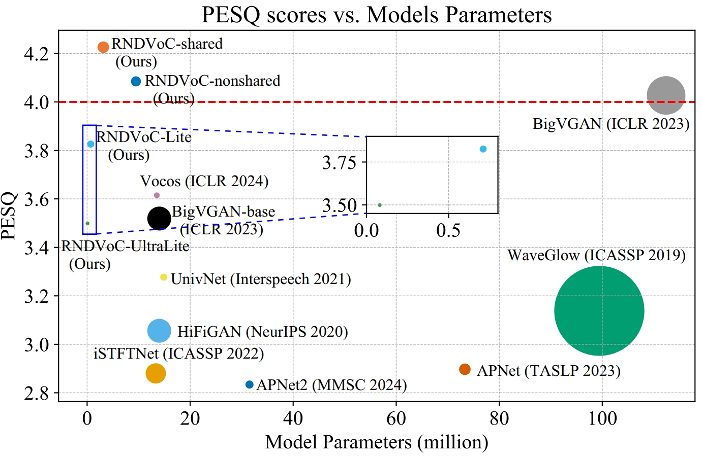
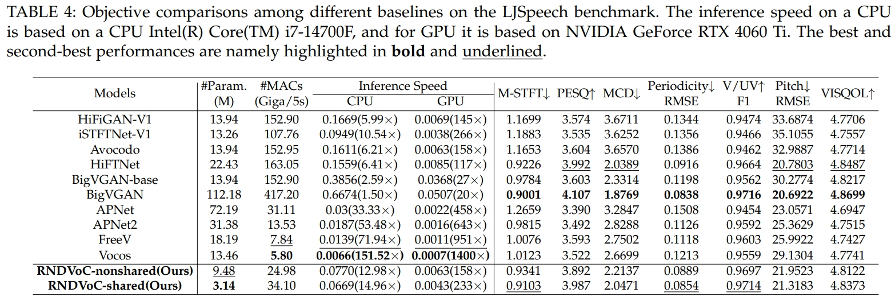
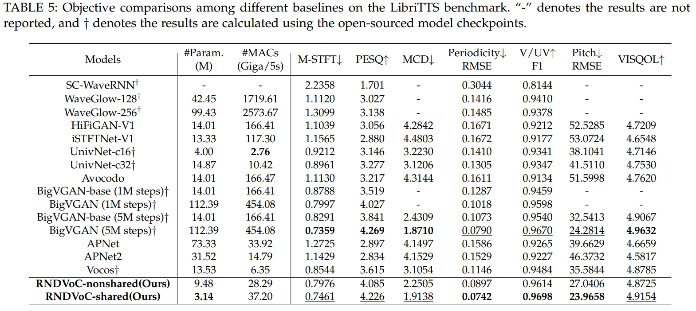
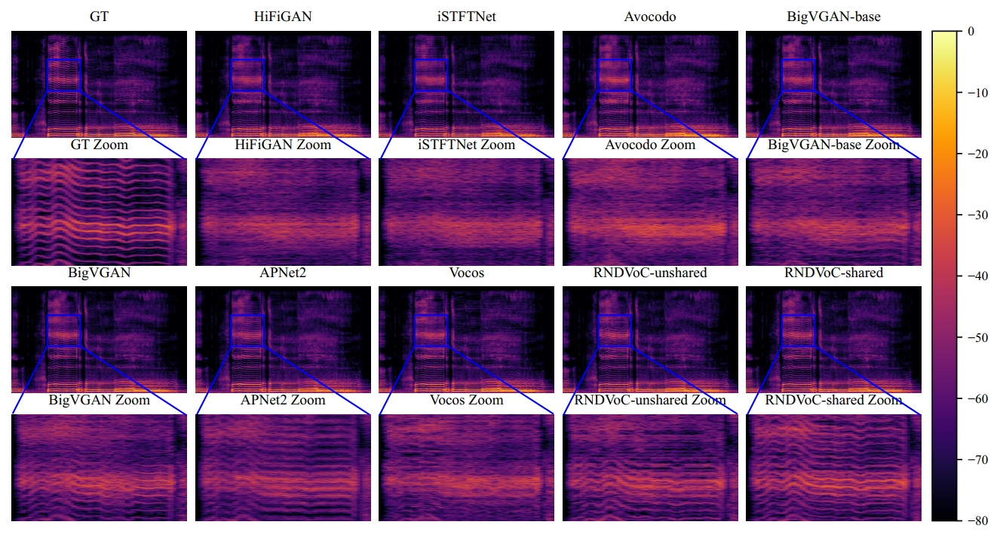
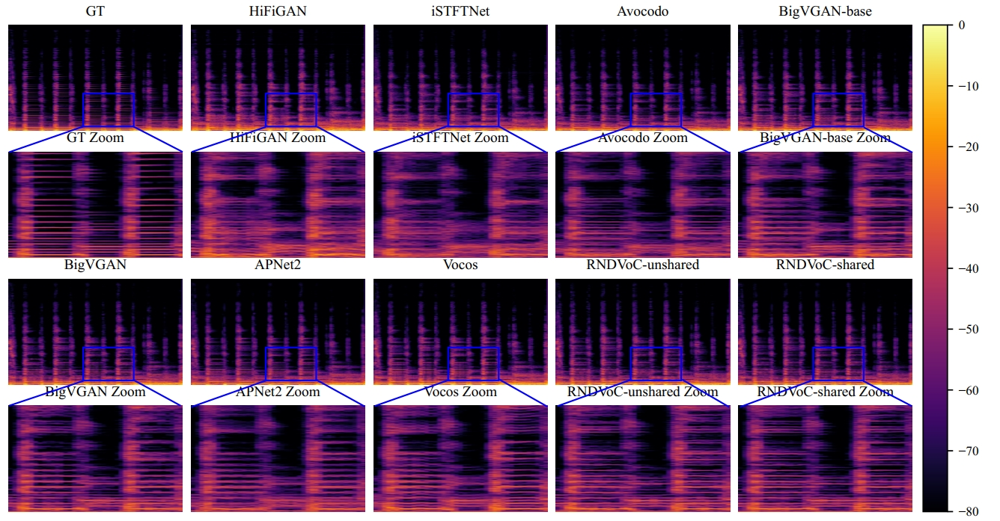
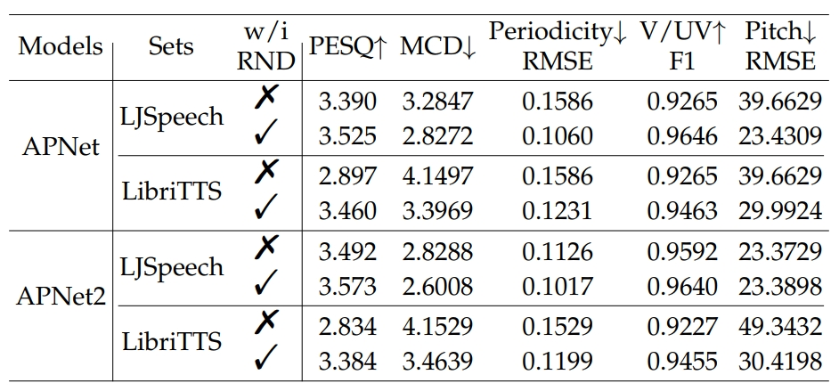
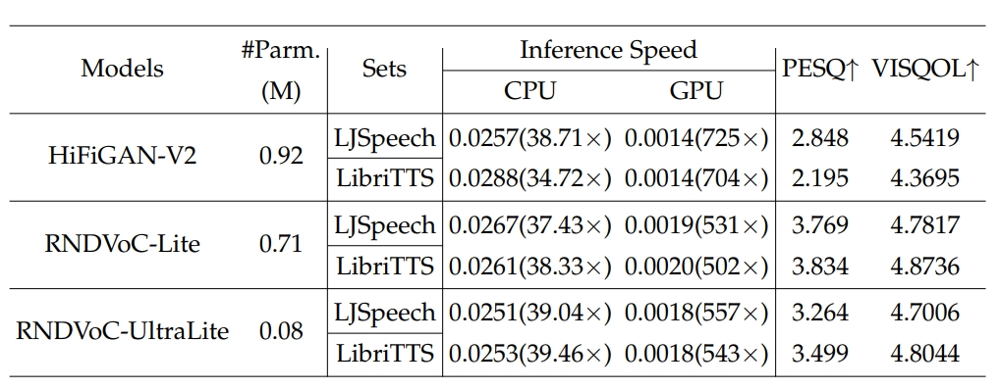

# Scalable Neural Vocoder from Range-Null Space Decomposition (submitted to IEEE TPAMI)

### Authors: Andong Li, Tong Lei, Zhihang Sun, Rilin Chen, Xiaodong Li, and Chengshi Zheng

<a href=""></a>  

---
## Update
- **2025.01.09**: Create this repo.
  
## Abstract
Although deep neural networks have facilitated significant progress of neural vocoders in recent years, they usually suffer
from intrinsic challenges like opaque modeling, inflexible retraining under different input configurations, and parameter-performance
trade-off. These inherent hurdles can heavily impede the development of this field. To resolve these problems, in this paper, we
propose a novel neural vocoder in the time-frequency (T-F) domain. Specifically, we bridge the connection between the classical
range-null decomposition (RND) theory and the vocoder task, where the reconstruction of the target spectrogram is formulated into the
superimposition between range-space and null-space. The former aims to project the representation in the original mel-domain into the
target linear-scale domain, and the latter can be instantiated via neural networks to further infill the spectral details. To fully leverage
the spectrum prior, an elaborate dual-path framework is devised, where the spectrum is hierarchically encoded and decoded, and the
cross- and narrow-band modules are leveraged for effectively modeling along sub-band and time dimensions. To enable inference
under various configurations, we propose a simple yet effective strategy, which transforms the multi-condition adaption in the inference
stage into the data augmentation in the training stage. Comprehensive experiments are conducted on the LJSpeech and LibriTTS
benchmarks. Quantitative and qualitative results show that while enjoying lightweight network structure and scalable inference
paradigm, the proposed framework achieves state-of-the-art performance among existing advanced methods. 

## Experiments

### Bubble Figure



### On LJSeech benchmark


### On LibriTTS benchmark


### Visualization on MUSDB18 test set
#### Vocal voice


#### Bass sound


### Apply RND to existing T-F domain-based vocoders (Plug-and-play)


### Toward light-weight design


## Citation
```bibtex
@article{xxxx,
      title={Scalable Neural Vocoder from Range-Null Space Decomposition}, 
      author={Andong Li and Tong Lei and Zhihang Sun and Rilin Chen and Xiaodong Li and Chengshi Zheng},
      year={2025},
      eprint={xxxx.xxxxx},
      archivePrefix={xxxx},
      url={xxxxxxxx}, 
}
```
